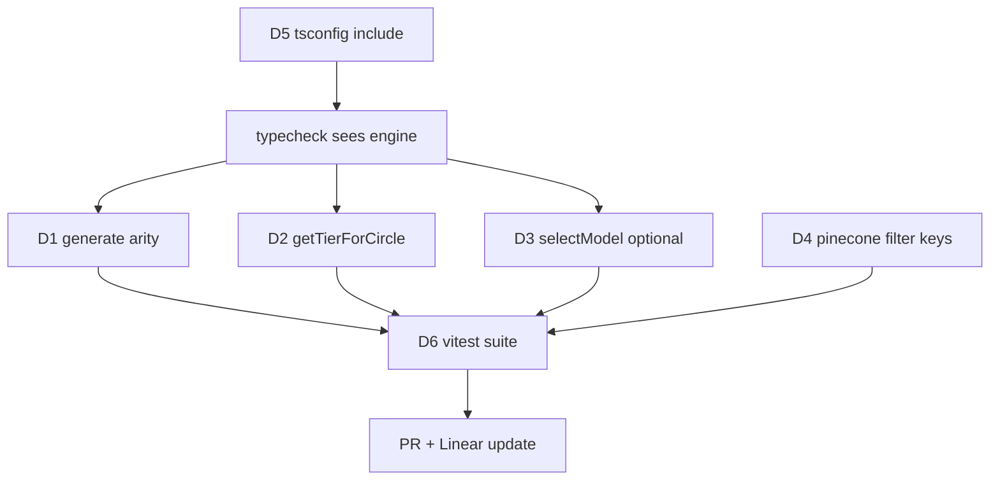

# AI-6862 — Test & Validate Reply Like Me (PERS-403/405/418-420)

## System map (as-found)

```
                        ┌──────────────────────────┐
   inbound iMessage ───▶│  MCP server  src/index.ts│  (PERS-405)
                        │  8 tools, stdio transport│
                        └────────────┬─────────────┘
                                     │ engine.generateReply(contactId, text)
                                     ▼
                        ┌──────────────────────────┐
                        │ reply-engine.ts (PERS-403)│
                        └────┬───────┬───────┬─────┘
             buildContext    │       │       │  applyCadenceModel
              (PERS-418)     │       │       │   (PERS-420)
        ┌──────────┬─────────┘       │       └────────┐
        ▼          ▼                 ▼                ▼
 ┌────────────┐ ┌──────────┐  ┌──────────────┐ ┌────────────┐
 │ Supabase   │ │ Pinecone │  │ llm-router   │ │  bubbles[] │
 │ contacts / │ │ similar  │  │  (PERS-419)  │ │ → drafts   │
 │ profile /  │ │ messages │  │ inner→claude │ └────────────┘
 │ messages   │ │          │  │ key →deepseek│
 └────────────┘ └──────────┘  │ else →ollama │
                              └──────────────┘
```

## Defects found by validation

| # | Defect | Layer | Symptom |
|---|---|---|---|
| D1 | `router.generate(cfg, sys, user)` but router accepts 2 args | PERS-419 | compile error; userPrompt dropped |
| D2 | `router.getTierForCircle()` does not exist | PERS-419 | compile error / TypeError |
| D3 | `selectModel(rank)` vs required 2-arg interface | PERS-419 | compile error |
| D4 | Pinecone filter `{contact_id, is_from_me}` but index written with `{phone, direction}` | PERS-418 | 0 matches, swallowed by try/catch — silent |
| D5 | `tsconfig.include` omits engine/router/supabase | build | `npm run build` green while engine broken |
| D6 | Zero test files despite `"test": "vitest run"` | all | nothing validated |



## Component breakdown

| Component | Purpose | Inputs | Outputs | Dependencies |
|---|---|---|---|---|
| `llm-router.ts` | tier select + fallback chain | circle_rank, prompts | LLMResponse | fetch |
| `reply-engine.ts` | context -> prompt -> gen -> bubbles | contactId, text | DraftReply | store, router, pinecone |
| `tests/*.test.ts` | validate 403/418/419/420 | fakes | pass/fail | vitest |

## Autonomy note
Ran in autonomous shipping mode (no human in loop), so the visual plan is recorded here
rather than blocking for approval.
